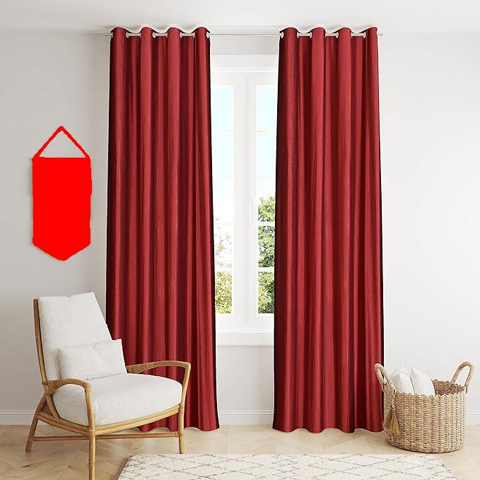
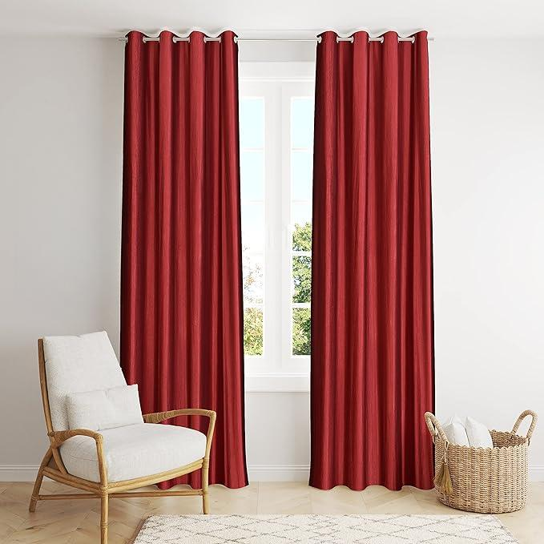

# Image-Position-Editing


## Table of Contents
- [Introduction](#introduction)
- [Requirements](#requirements)
- [Installation](#installation)
- [Usage](#usage)
  - [Common Arguments](#common-arguments)
  - [Tasks](#tasks)
    - [Task 1: Generate Red Mask on the Object](#task-1-generate-red-mask-on-the-object)
    - [Task 2: Change Position of the Segmented Object](#task-2-change-position-of-the-segmented-object)
    - [Task 3: Remove the Object](#task-3-remove-the-object)
- [Examples](#examples)
- [Directory Structure](#directory-structure)
- [Configuration Files](#configuration-files)

## Introduction

`Image-Position-Editing` is a versatile image processing tool that allows users to perform various tasks on images, such as generating segmented masks, changing the position of segmented objects, and removing objects. This tool leverages advanced segmentation models to achieve these tasks efficiently.

<p align="center">
  <a href="https://colab.research.google.com/drive/1G1cSXiL2Jiwo0DT-vO5f4H_bEiNqbcoz?usp=sharing">
  
  </a>
      <br>
   Try out in Google Colab
</p>

## Requirements

- Python 3.6+
- `src` package including `Image-Position-Editing`
- Additional dependencies as specified in `requirements.txt`

## Installation

1. Clone the repository:
    ```sh
    git clone https://github.com/luckygyana/Image-Position-Editing.git
    cd ImageEditor
    ```

2. Install the required dependencies:
    ```sh
    pip install -r requirements.txt
    python -m pip install -r lama/requirements.txt 
    ```

3. Download the model checkpoints provided in [big-lama](https://disk.yandex.ru/d/ouP6l8VJ0HpMZg), and put them into `./pretrained_models`. For simplicity, you can also go [here](https://drive.google.com/drive/folders/1ST0aRbDRZGli0r7OVVOQvXtadMCuWXg?usp=sharing), directly download [pretrained_models](https://drive.google.com/drive/folders/1wpY-upCo4GIW4wVPnlMh_ym779lLIG2A?usp=sharing), put the directory into `./` and get `./pretrained_models`.

## Usage

The `Image-Position-Editing` script can be used from the command line to perform various image processing tasks. Below are the common arguments and task-specific arguments.

### Common Arguments

- `--image`: Path to the input image (required).
- `--class`: Class of the object to be segmented (required).
- `--output`: Path to the output image (required).

### Tasks

#### Task 1: Generate Segmented Mask on the Object

Generates a segmented mask over the specified object in the image.

```sh
python script.py --image path/to/image.jpg --class "object_class" --output path/to/output.jpg task1
```

#### Task 2: Change Position of the Segmented Object

Changes the position of the segmented object by the specified number of pixels in the x and y directions.

```sh
python script.py --image path/to/image.jpg --class "object_class" --output path/to/output.jpg task2 --x shift_x --y shift_y
```

- `--x`: Number of pixels to shift in the x direction (required).
- `--y`: Number of pixels to shift in the y direction (required).

#### Task 3: Remove the Object

Removes the specified object from the image.

```sh
python script.py --image path/to/image.jpg --class "object_class" --output path/to/output.jpg task3
```

## Examples

### Example 1: Generate Segmented Mask

```sh
python script.py --image wall_hanging.jpg --class "wall hanging" --output masked_wall_hanging.jpg task1
```

**Input and Output:**

| Input Image | Output Image |
|:------------:|:------------:|
|  |  |

### Example 2: Change Object Position

```sh
python script.py --image wall_hanging.jpg --class "wall hanging" --output moved_wall_hanging".jpg task2 --x 500 --y 100
```

**Input and Output:**

| Input Image | Output Image |
|:------------:|:------------:|
|  |  |

### Example 3: Remove Object

```sh
python script.py --image ../example/wall_hanging.jpg --class "wall hanging" --output no_wall_hanging.jpg task3
```

**Input and Output:**

| Input Image | Output Image |
|:------------:|:------------:|
|  |  |

## Directory Structure

```
Image-Position-Editing/
├── lama/
│   ├── configs/
│   │   └── prediction/
│   │       └── default.yaml
│   └── pretrained-models/
│       └── big-lama
|   └── requirements.txt
├── src.py
├── run.py
├── requirements.txt
└── README.md
```

## Configuration Files

The `lama` directory contains the necessary configuration files and pre-trained models for performing the image editing tasks. The default configuration file for predictions is located at `lama/configs/prediction/default.yaml`.

## Acknowledgments

* Segmentation code and models if form [CSAILVision](https://github.com/CSAILVision/semantic-segmentation-pytorch).
* Lama Model from [LaMa](https://github.com/advimman/lama)
* LPIPS metric is from [richzhang](https://github.com/richzhang/PerceptualSimilarity)
* SSIM is from [Po-Hsun-Su](https://github.com/Po-Hsun-Su/pytorch-ssim)
* FID is from [mseitzer](https://github.com/mseitzer/pytorch-fid)
* [Inpaint-Anything](https://github.com/geekyutao/Inpaint-Anything)
* [GroundingDINO](https://github.com/IDEA-Research/GroundingDINO)
* [Segment-Anything](https://github.com/facebookresearch/segment-anything)
* [Lightning AI](https://github.com/Lightning-AI/lightning)

---

For any further questions or support, please open an issue on the [GitHub repository](https://github.com/luckygyana/Image-Position-Editing).